# **Dragonball Service** 🐉 

Este servicio permite crear un personaje de Dragon Ball.

## 🚀 **Ejecución del Servicio**

### **Prerequisitos** 📌 

- Go (versión 1.23 o superior). Descárgalo [aquí](https://golang.org/dl/).
- Docker (opcional, si deseas ejecutarlo en contenedor).

---




```mermaid
sequenceDiagram
    participant Cliente
    participant App
    participant SQLite
    participant API Externa

    Cliente->>App: POST http://localhost:8080/characters
    App->>SQLite: ¿Existe personaje?
    alt Personaje existe en BD
        SQLite-->>App: Retorna personaje
    else Personaje no existe en BD
        App->>API Externa: Consulta personaje
        API Externa-->>App: Respuesta con datos
        App->>SQLite: Guarda personaje en BD
    end
    App-->>Cliente: Respuesta con personaje
```

## 📥 **Instalación**

1. **Clona este repositorio**:

   ```bash
   git clone git@github.com:panxomon/dragonball-api.git
   ```

2. **Accede al directorio del proyecto**:

   ```bash
   cd dragonball-api
   ```

3. **Instala las dependencias**:

   ```bash
   make dep
   ```

---

## 🛠 **Uso**

1. **Configura las variables de entorno** usando el archivo de ejemplo:

   ```bash
   cp .env.example .env
   ```

2. **Ejecuta el servicio**:

   ```bash
   make run
   ```

Si prefieres Docker:

```bash
docker-compose up --build
```

---

## 📡 **Endpoints**

### **Crear un personaje**
Puedes crear un personaje usando la API con el siguiente comando `cURL`:

```bash
curl --location 'http://localhost:8080/characters' \
--header 'Content-Type: application/json' \
--data '{
    "name": "Goku"
}'
```

Si la petición es exitosa, recibirás una respuesta con los datos generados.

---

## 🧰 **Utilidades**

- 📝 **Colección de Postman**: Se encuentra en `/postman`, lista para importar y probar los endpoints fácilmente. 🚀 

---
